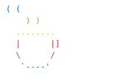

# Brew Kernel


Brew Kernel is a simple x86_64 kernel that demonstrates basic OS concepts. It features a custom bootloader, VGA text mode output with customizable colors, and basic interrupt handling.

## Features

- 64-bit long mode support
- Multiboot2 compliant
- Custom VGA text mode driver with 16-color palette support
- Basic Interrupt Descriptor Table (IDT) implementation
- ASCII character display demo
- Integer output support with signed and unsigned number handling
**- Able to run on actual x86_64 hardware.**


## Prerequisites

To build the kernel, you'll need Docker installed on your system. The build environment is containerized to ensure consistency across different systems.

## Building

1. First, build the Docker container for the build environment:

```sh
cd buildenv
docker build -t brewkernel-buildenv .
```

2. Return to the project root and run the build script:

```sh
cd ..
docker run --rm -v $(pwd):/root/env brewkernel-buildenv make build-x86_64
```

The build process will create:
- A kernel binary at `dist/x86_64/kernel.bin`
- A bootable ISO image at `dist/x86_64/kernel.iso`

## Running

You can run the kernel using QEMU:

```sh
qemu-system-x86_64 -cdrom dist/x86_64/kernel.iso
```


## Project Structure

- `src/impl/kernel/` - Main kernel implementation
- `src/impl/x86_64/` - Architecture-specific code
- `src/intf/` - Header files and interfaces
- `targets/` - Target-specific files (linker scripts, GRUB config)
- `buildenv/` - Docker build environment
- `dist/` - Build output directory

## Technical Details

### Memory Map

- Kernel is loaded at 1MB (0x100000)
- Stack is 16KB
- Page tables are set up for identity mapping

### VGA Text Mode

- Resolution: 80x25 characters
- 16-color palette support
- Memory mapped at 0xB8000

### Interrupts

Basic IDT setup with handlers for:
- Division by Zero (Vector 0)
- Debug Exception (Vector 1)
- Page Fault (Vector 14)

## License

Copyright (C) 2024-2025 boreddevhq

This program is free software: you can redistribute it and/or modify it under the terms of the GNU General Public License as published by the Free Software Foundation, either version 3 of the License, or (at your option) any later version.


